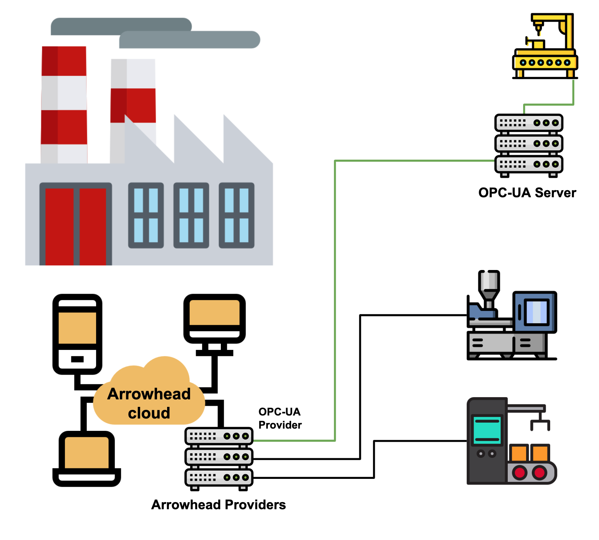

**Figure 1. The image represents the general concept of how this repository can help you integrate an OPC-UA Server to an Arrowhead Local cloud. The green lines show how the OPC-UA Provider included in this repository can be used to connect to equipment and sensors controlled by an OPC-UA server.**

(Icons made by <a href="https://www.flaticon.com/authors/freepik" title="Freepik">Freepik</a> from <a href="https://www.flaticon.com/" title="Flaticon">www.flaticon.com</a></div>
)

# Arrowhead_OPC-UA
This project provides the possibility to integrate an existing OPC-UA Server with Consumers in an [Arrowhead Framework](http://github.com/arrowhead-f) local cloud. It is based on the [Eclipse Milo (tm)](https://github.com/eclipse/milo) OPC-UA stack and the [Client Skeletons](https://github.com/arrowhead-f/client-skeleton-java-spring) for the [Arrowhead Framework 4.1.3](https://github.com/arrowhead-f/core-java-spring).

This repository has an example Provider and Consumer. The Provider allows Consumers to read and write OPC-UA Variable nodes in an OPC-UA Server using a REST API. When the Provider is started it will:

1. Connect to an OPC-UA server using connection details found in /src/main/resources/application.properties. 
2. Browse all Variable nodes beneath a given "root" node (also provided in application.properties), and register read/write services for all OPC-UA Variables nodes beneath this "root" Node to the Service Registry. The service definition for each will be prefixed with read_ or write_ (e.g. read_myVariable or write_myVariable). The term "root" is chosen here since no nodes above this node in the OPC-UA hierarchy will be added to the service registry making it the top level object.
3. Respond to incoming traffic to the REST API read/write services.

The example Consumer queries the Orchestrator for an OPC-UA Variable (beneath the chosen "root" node) to read or write, using the read_ or write_ prefix (e.g. write_myVariable) and receives the REST API endpoint (Service URI) for this service. When writing a variable, add your desired value to a query parameter named "value". The provided value will be cast to the proper variable type (as defined in the target OPC-UA Variable node). When using a read-service, leave the "value" query parameter empty. 
 
NOTE! The code provided in this repository is provided only as a skeleton/starting point and needs to be extended to fit the application at hand.

## How to use

### Requirements
* Java JRE/JDK 11
* Maven 3.5+
* Arrowhead core services running, for more info goto [Arrowhead Framework 4.1.3](https://github.com/arrowhead-f/core-java-spring)
* To run the example Provider and Consumer, your OPC-UA Server should be configured with no security mode and no security policy. You can later add your own desired OPC-UA security using the [Eclipse Milo Stack](https://github.com/eclipse/milo) which this repository is based on.
* All variables below the chosen "root" node in the OPC-UA server should be both readable and writeable.


### Setup and run
1. Download or clone the repository.
2. Select a Node in your OPC-UA server that will serve as a root. All found Variable Nodes below this root
will be added to the Arrowhead Service Registry and exposed via a REST api. 
3. Edit the /src/main/resources/application.properties file to match your setup (Core systems, security configs, system names etc)
4. Build the code (e.g. for both Provider and Consumer you can run "maven package" in the root directory of the project)
4. Add rights to use the different services and service interfaces to the Consumer (e.g. intra_cloud and intra_cloud_connection_interfaces tables in the MySQL database).

To run your Provider, go to client-skeleton-provider/target folder and run: ```java -jar arrowhead-client-skeleton-provider-4.1.3.1.jar```.
To run your Consumer, go to client-skeleton-consumer/target folder and run: ```java -jar arrowhead-client-skeleton-consumer-4.1.3.1.jar```.

### Best practices
Note that the code provided in this repository is provided only as a starting point and needs to be extended to fit the application at hand. Please use the [best practices of the Arrowhead Spring skeletons](https://github.com/arrowhead-f/client-skeleton-java-spring#best-practices-to-start-with-the-skeletons) and [the OPC-UA documentation](https://opcfoundation.org/developer-tools/specifications-unified-architecture) when designing your application.
